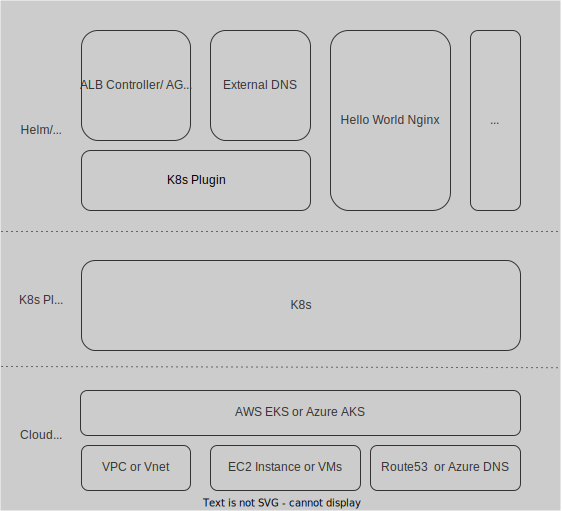

# cloud-agnostic-container-mgmt

A project to help you run container workloads in the cloud-agnostic style.

In this repo you find ways to run a workload, demonstrated with hello world nginx web server inside a container and deploy it to the different managed Kubernetes Services from the various cloud providers using a few so called Kubernetes Plugins. We will also find how it can be done with different IAC tools. The container/Kubernetes Layer pules in a kind of more or less standardized layer that all providers support and that can be advantageous in case you want to keep the door open for a eventual migration of your workloads between different cloud provider with a manageable amount of effort.

Here is the tech stack, visualizing the basic idea that the lowest layer "Cloud Provider" can be exchanged as a whole or maybe even in parts in case eer needed:

<!-- For more in depth reading about cloud agnosticism and multi-cloud you can read the [related blog article to this repo](https://blog.knip-builds.de/posts/multi-cloud-all-the-way/). -->

## Implementation examples

Different ways to do same thing. In the sub directories of this repo you can find the different instances of implementing our demo case in cloud-agnostic style. From the names of folders you get indication about the cloud provider and the IaC tool that has been used:

- [aws-pulumi](./aws-pulumi/README.md)
- [azure-terraform](./az-terraform/README.md)
- azure-pulumi 👷‍♂️👷‍♀️ _(Stay tuned. Work in progress)_
- gcp-terraform 👷‍♂️👷‍♀️ _(Stay tuned. Work in progress)_

## FAQs

### How can using AWS EKS or Azure AKS be cloud-agnostic in any way?

t.b.a.

### What's a "Kubernetes Plugin"?

t.b.a.

### What about cloud-agnostic DNS Service?

t.b.a.

