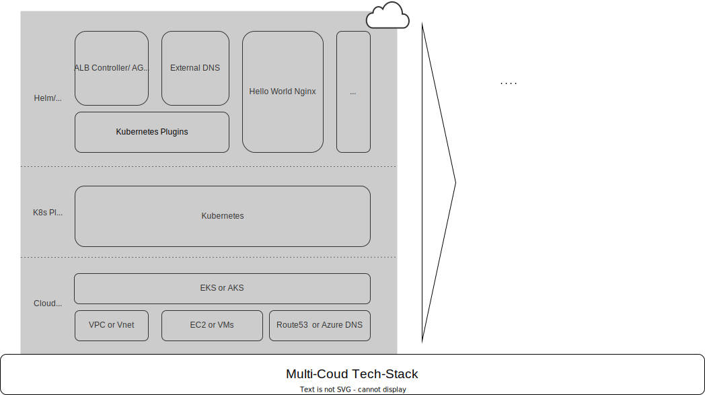

# cloud-agnostic-container-mgmt

_A cloud infrastructure project that enables you to run and manage container workloads the cloud-agnostic style._

## General idea

In this repo you will find examples to run a workload the cloud-agnostic way, demonstrated with a hello world nginx workload. Achieve that, we make use of the various managed Kubernetes Services from different cloud providers using a few so called Kubernetes Plugins. You will also find how it can be done with different IAC tools. The container/Kubernetes Layer pulls in a layer that enforces some degree of standardization that all providers support and that can be advantageous in case you want to keep the door open for a eventual migration of your workloads between different cloud provider with a manageable amount of effort.

Here is the tech stack suggesting the basic idea that the lower layer "Cloud Provider" can be exchanged as a whole or maybe even in parts in case ever needed:

<!-- For more in depth reading about cloud agnosticism and multi-cloud you can read the [related blog article to this repo](https://blog.knip-builds.de/posts/multi-cloud-all-the-way/). -->

## Implementation examples

Different ways to do same thing: In the sub directories of this repo you can find the different instances of the demo case. From the names of folders you get indication about the cloud provider and the IaC tool that has been used:

- [azure-terraform](az-terraform/README.MD)
- [aws-pulumi](aws-pulumi/README.md)
- azure-pulumi 👷‍♂️👷‍♀️ _(Stay tuned. Work in progress)_
- gcp-terraform 👷‍♂️👷‍♀️ _(Stay tuned. Work in progress)_

## FAQs

### How can using AWS EKS or Azure AKS be cloud-agnostic in any way?

t.b.a.

### What's a "Kubernetes Plugin"?

t.b.a.

### What about cloud-agnostic DNS Service?

t.b.a.
