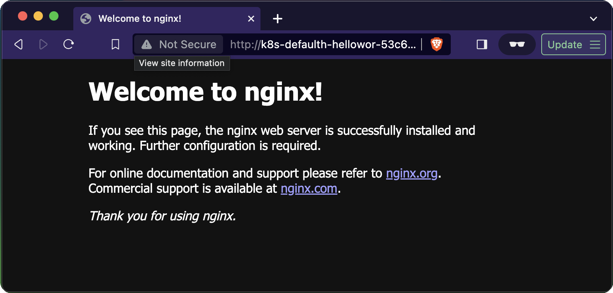

# Multi-Cloud - Azure Terraform k8s platform

## Prerequs:

- Some Pulumi KnowHow or at least Infrastructure-As-Code Knowhow
- Basic Typescript Node Knowledge
- An AWS account with AdministratorAccess or similar permissionSet
- AWS knowledge, alternatively knowledge in some other hyperscaler (Azure, GCP) should be sufficient

## Dependencies

- [Pulumi v3.107.0](https://www.pulumi.com/docs/install/)
- [yarn](https://classic.yarnpkg.com/lang/en/docs/install/#mac-stable)
- [AWS CLI v2](https://docs.aws.amazon.com/cli/latest/userguide/getting-started-install.html)

## Getting started

### Login to Cloud account (AWS):

[Login](https://docs.aws.amazon.com/signin/latest/userguide/how-to-sign-in.html) to your AWS account with your terminal. I highly recommend using [AWS SSO](https://docs.aws.amazon.com/sdkref/latest/guide/access-sso.html) in combination with a configured AWS profile. More details on different options to sign in [here](https://docs.aws.amazon.com/signin/latest/userguide/how-to-sign-in.html).

Test that you are logged into the right account:

```sh
aws sts get-caller-identity --profile <your-profile>
```

Choose a name for your [Pulumi Backend](https://www.pulumi.com/docs/intro/concepts/state/), export it as env var to your terminal...

```sh
export PULUMI_BACKEND=<your-pulumi-backend-name>
```

...and create the s3 bucket that will later hold the remote state of the IAC project by doing the following:

```sh
aws s3 mb s3://$PULUMI_BACKEND
```

_Note: Only execute this command once at initial setup of the project_

Login to Pulumi Backend:

```sh
pulumi login s3://$PULUMI_BACKEND
```

### Build the project using [yarn](https://classic.yarnpkg.com/en/):

```sh
yarn
```

### Create Pulumi Stack

Choose a name for your [Pulumi Stack](https://www.pulumi.com/docs/intro/concepts/stack/) and create the stack:

```sh
export PULUMI_STACK_NAME=<your-stack-name> # e.g. dev
pulumi stack init $PULUMI_STACK_NAME
```

### Configure and preview the deployment

```sh
pulumi preview
```

```sh
Previewing update (dev):
     Type                                          Name                                       Plan
 +   pulumi:pulumi:Stack                           cloud-agnostic-container-mgmt-dev          create
 +   ├─ eks:index:Cluster                          cluster                                    create
 +   │  ├─ eks:index:ServiceRole                   cluster-instanceRole                       create
 +   │  │  ├─ aws:iam:Role                         cluster-instanceRole-role                  create
 +   │  │  ├─ aws:iam:RolePolicyAttachment         cluster-instanceRole-e1b295bd              create
 +   │  │  ├─ aws:iam:RolePolicyAttachment         cluster-instanceRole-03516f97              create
 +   │  │  └─ aws:iam:RolePolicyAttachment         cluster-instanceRole-3eb088f2              create
 +   │  ├─ eks:index:ServiceRole                   cluster-eksRole                            create
 +   │  │  ├─ aws:iam:Role                         cluster-eksRole-role                       create
 +   │  │  └─ aws:iam:RolePolicyAttachment         cluster-eksRole-4b490823                   create
 +   │  ├─ eks:index:RandomSuffix                  cluster-cfnStackName                       create
 +   │  ├─ aws:iam:InstanceProfile                 cluster-instanceProfile                    create
 +   │  ├─ aws:ec2:SecurityGroup                   cluster-eksClusterSecurityGroup            create
 +   │  ├─ aws:ec2:SecurityGroupRule               cluster-eksClusterInternetEgressRule       create
 +   │  ├─ aws:eks:Cluster                         cluster-eksCluster                         create
 +   │  ├─ eks:index:VpcCni                        cluster-vpc-cni                            create
 +   │  ├─ pulumi:providers:kubernetes             cluster-eks-k8s                            create
 +   │  ├─ aws:iam:OpenIdConnectProvider           cluster-oidcProvider                       create
 +   │  ├─ aws:ec2:SecurityGroup                   cluster-nodeSecurityGroup                  create
 +   │  ├─ kubernetes:core/v1:ConfigMap            cluster-nodeAccess                         create
 +   │  ├─ aws:ec2:SecurityGroupRule               cluster-eksNodeClusterIngressRule          create
 +   │  ├─ aws:ec2:SecurityGroupRule               cluster-eksNodeInternetEgressRule          create
 +   │  ├─ aws:ec2:SecurityGroupRule               cluster-eksExtApiServerClusterIngressRule  create
 +   │  ├─ aws:ec2:SecurityGroupRule               cluster-eksClusterIngressRule              create
 +   │  ├─ aws:ec2:SecurityGroupRule               cluster-eksNodeIngressRule                 create
 +   │  ├─ aws:ec2:LaunchConfiguration             cluster-nodeLaunchConfiguration            create
 +   │  ├─ aws:cloudformation:Stack                cluster-nodes                              create
 +   │  └─ pulumi:providers:kubernetes             cluster-provider                           create
 +   ├─ aws:iam:Policy                             aws-loadbalancer-controller-policy         create
 +   ├─ aws:iam:Policy                             external-dns-policy                        create
 +   ├─ aws:route53:DelegationSet                  dns-delegation-set                         create
 +   ├─ awsx:ec2:Vpc                               vpc                                        create
 +   │  └─ aws:ec2:Vpc                             vpc                                        create
 +   │     ├─ aws:ec2:Subnet                       vpc-PrivSn-1-3                             create
 +   │     │  └─ aws:ec2:RouteTable                vpc-PrivSn-1-3                             create
 +   │     │     ├─ aws:ec2:RouteTableAssociation  vpc-PrivSn-1-3                             create
 +   │     │     └─ aws:ec2:Route                  vpc-PrivSn-1-3                             create
 +   │     ├─ aws:ec2:Subnet                       vpc-PubSn-2-1                              create
 +   │     │  └─ aws:ec2:RouteTable                vpc-PubSn-2-1                              create
 +   │     │     ├─ aws:ec2:RouteTableAssociation  vpc-PubSn-2-1                              create
 +   │     │     └─ aws:ec2:Route                  vpc-PubSn-2-1                              create
 +   │     ├─ aws:ec2:Subnet                       vpc-PubSn-2-3                              create
 +   │     │  └─ aws:ec2:RouteTable                vpc-PubSn-2-3                              create
 +   │     │     ├─ aws:ec2:RouteTableAssociation  vpc-PubSn-2-3                              create
 +   │     │     └─ aws:ec2:Route                  vpc-PubSn-2-3                              create
 +   │     ├─ aws:ec2:Subnet                       vpc-PrivSn-1-2                             create
 +   │     │  └─ aws:ec2:RouteTable                vpc-PrivSn-1-2                             create
 +   │     │     ├─ aws:ec2:RouteTableAssociation  vpc-PrivSn-1-2                             create
 +   │     │     └─ aws:ec2:Route                  vpc-PrivSn-1-2                             create
 +   │     ├─ aws:ec2:Subnet                       vpc-PubSn-2-2                              create
 +   │     │  └─ aws:ec2:RouteTable                vpc-PubSn-2-2                              create
 +   │     │     ├─ aws:ec2:RouteTableAssociation  vpc-PubSn-2-2                              create
 +   │     │     └─ aws:ec2:Route                  vpc-PubSn-2-2                              create
 +   │     ├─ aws:ec2:InternetGateway              vpc                                        create
 +   │     ├─ aws:ec2:Subnet                       vpc-PrivSn-2-2                             create
 +   │     │  └─ aws:ec2:RouteTable                vpc-PrivSn-2-2                             create
 +   │     │     ├─ aws:ec2:RouteTableAssociation  vpc-PrivSn-2-2                             create
 +   │     │     └─ aws:ec2:Route                  vpc-PrivSn-2-2                             create
 +   │     ├─ aws:ec2:Subnet                       vpc-PubSn-1-2                              create
 +   │     │  ├─ aws:ec2:RouteTable                vpc-PubSn-1-2                              create
 +   │     │  │  ├─ aws:ec2:RouteTableAssociation  vpc-PubSn-1-2                              create
 +   │     │  │  └─ aws:ec2:Route                  vpc-PubSn-1-2                              create
 +   │     │  ├─ aws:ec2:Eip                       vpc-2                                      create
 +   │     │  └─ aws:ec2:NatGateway                vpc-2                                      create
 +   │     ├─ aws:ec2:Subnet                       vpc-PubSn-1-3                              create
 +   │     │  ├─ aws:ec2:RouteTable                vpc-PubSn-1-3                              create
 +   │     │  │  ├─ aws:ec2:RouteTableAssociation  vpc-PubSn-1-3                              create
 +   │     │  │  └─ aws:ec2:Route                  vpc-PubSn-1-3                              create
 +   │     │  ├─ aws:ec2:Eip                       vpc-3                                      create
 +   │     │  └─ aws:ec2:NatGateway                vpc-3                                      create
 +   │     ├─ aws:ec2:Subnet                       vpc-PrivSn-1-1                             create
 +   │     │  └─ aws:ec2:RouteTable                vpc-PrivSn-1-1                             create
 +   │     │     ├─ aws:ec2:RouteTableAssociation  vpc-PrivSn-1-1                             create
 +   │     │     └─ aws:ec2:Route                  vpc-PrivSn-1-1                             create
 +   │     ├─ aws:ec2:Subnet                       vpc-PrivSn-2-1                             create
 +   │     │  └─ aws:ec2:RouteTable                vpc-PrivSn-2-1                             create
 +   │     │     ├─ aws:ec2:RouteTableAssociation  vpc-PrivSn-2-1                             create
 +   │     │     └─ aws:ec2:Route                  vpc-PrivSn-2-1                             create
 +   │     ├─ aws:ec2:Subnet                       vpc-PrivSn-2-3                             create
 +   │     │  └─ aws:ec2:RouteTable                vpc-PrivSn-2-3                             create
 +   │     │     ├─ aws:ec2:RouteTableAssociation  vpc-PrivSn-2-3                             create
 +   │     │     └─ aws:ec2:Route                  vpc-PrivSn-2-3                             create
 +   │     └─ aws:ec2:Subnet                       vpc-PubSn-1-1                              create
 +   │        ├─ aws:ec2:Eip                       vpc-1                                      create
 +   │        ├─ aws:ec2:RouteTable                vpc-PubSn-1-1                              create
 +   │        │  ├─ aws:ec2:RouteTableAssociation  vpc-PubSn-1-1                              create
 +   │        │  └─ aws:ec2:Route                  vpc-PubSn-1-1                              create
 +   │        └─ aws:ec2:NatGateway                vpc-1                                      create
 +   ├─ kubernetes:apps/v1:Deployment              helloworld                                 create
 +   ├─ kubernetes:core/v1:Service                 helloworld                                 create
 +   ├─ aws:iam:Role                               clusterAdminRole                           create
 +   ├─ aws:route53:Zone                           dns-hosted-zone                            create
 +   ├─ aws:iam:Role                               aws-loadbalancer-controller-role           create
 +   ├─ aws:iam:Role                               external-dns-role                          create
 +   ├─ aws:iam:PolicyAttachment                   external-dns-attachment                    create
 +   ├─ aws:iam:PolicyAttachment                   aws-load-balancer-controller-attachment    create
 +   ├─ pulumi:providers:kubernetes                provider                                   create
 +   ├─ kubernetes:core/v1:ServiceAccount          external-dns-service-account               create
 +   ├─ kubernetes:core/v1:Namespace               default-helloWorld                         create
 +   ├─ kubernetes:core/v1:ServiceAccount          aws-lb-controller-service-account          create
 +   ├─ kubernetes:helm.sh/v3:Release              external-dns                               create
 +   └─ kubernetes:helm.sh/v3:Release              lb                                         create


Outputs:
  + k8sClusterName: "cluster-eksCluster-1234xyz"

Resources:
    82 unchanged

Duration: 10s
```

_Note: The `k8sClusterName`. You can configure your local workstations kube-config like so: `aws eks update-kubeconfig --name cluster-eksCluster-1234xyz`_

Pulumi might prompt you for missing configs. In the end it should create a stack `.yaml`-file containing all pulumi configs. You can think of them as environment variables for your infrastructure project:

`Example of a filled in ./Pulumi.dev.yaml`

```yaml
encryptionsalt: v1:abcDEF123XZW=:v1:ABC123//:12345678xxxxxxxxxxxx
config:
  aws:region: eu-central-1
  cloud-agnostic-container-mgmt:pulumi-configs:
    clusterConfigs:
      desiredCapacity: 2
      # https://docs.aws.amazon.com/AWSEC2/latest/UserGuide/instance-types.html#AvailableInstanceTypes
      instanceType: t3.medium
      maxSize: 2
      minSize: 1
      additionalRoleMappings:
        # Replace this with your deployment role
        awsSsoAdminRoleArn: <YourAWSDeploymentRole>
    dns:
      baseDomainName: "multi-cloud-demo.company-as-code.com"

```


Pulumi might prompt you for missing configs. In the end it should create a stack `.yaml`-file containing all pulumi configs. You can think of them as environment variables for your infrastructure project:

`./Pulumi.my-cool-blog-prod.yaml`
```yaml
encryptionsalt: v1:abcDEF123XZW=:v1:ABC123//:12345678xxxxxxxxxxxx
config:
  static-website:pathToWebsiteContents: public
  static-website:targetDomain: blog.mycooldomain.com
  static-website:author: JonDoe
  static-website:organization: JonDoesOrg
```
> Hint: Dont worry about commiting the `encryptionsalt`. It's the encryption salt of your PULUMI_PASSPHRASE and NOT a secret. 


### Deploy the stack:

```sh
pulumi up
```

_(will deploy all infrastructure needed to host the static content and sync the content in the local `./public` folder with the s3 bucket.)_



Congrats! 🥳 You successfully deployed a Hello World WebApp to an Azure AKS K8s Cluster exposed via AGIC enabled Azure Application Gateway. Happy Multi-Clouding!

### Interact with the cluster

Update the kubeconfig

```sh
aws eks update-kubeconfig --name helloworld
```

### Troubleshooting

Get the logs. Note additional param `-c aws-eks-nodeagent`. It will in some cases give more insights into reasons why pods are failing

```
kubectl logs aws-node-jwwpd -n kube-system -c aws-eks-nodeagent
```

## Make it prettier

Prettier auto-formatting of your TS Code

- [This youtube video for prettier config](https://www.youtube.com/watch?v=11jpa8e5jEQ)
- [Github Repo for the video](https://github.com/JoshuaKGoldberg/create-typescript-app/blob/main/.vscode/settings.json)
- [nginx from docker hub will host our demo app](https://hub.docker.com/_/nginx)

## Refs:

- Some props to [OpenAIs ChatGPT](https://chat.openai.com/) [Plus version](https://openai.com/chatgpt/pricing) which does a quite job at providing pulumi TS code snippets

## Left-To-Dos:

- [ ] Probably many
- [ ] automate deployment using GH Actions
- [ ] Enable external DNS
- [ ] Upgrade to Kubernetes 1.29
