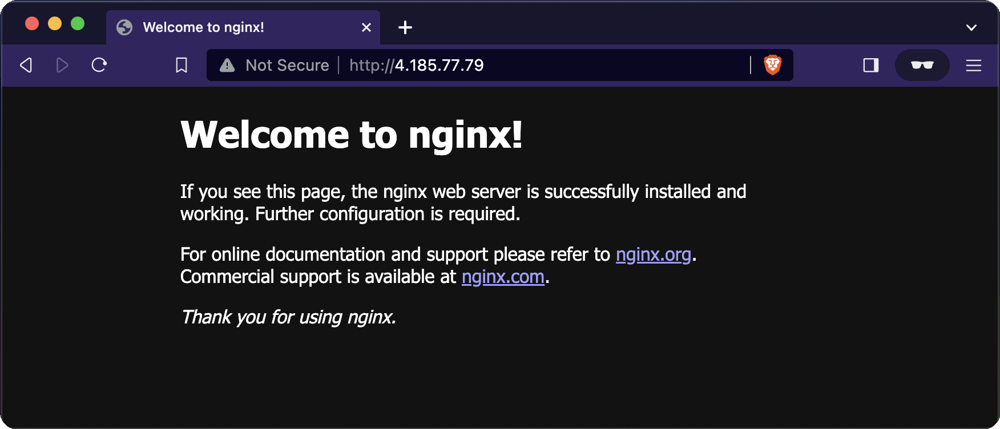

# Multi-Cloud - Azure Terraform k8s platform

## Prerequs:

- Some basic understanding of Infrastructure-As-Code such as terraform
- Azure knowledge, alternatively knowledge in some other hyperscaler (AWS, GCP) should be sufficient
- A fully fledged Azure subscription (Your user needs to be able to provision resources such as vnets, AKS, app registrations, Azure Application Gateway)
- A license set named ["Microsoft Entra ID P2"](https://www.microsoft.com/en-us/security/business/microsoft-entra-pricing?market=de). As of today 23.02.21, you can easily book a 1 month term 100 licenses
- A custom domain for DNS Zone

## Dependencies

MacOS:

- hashicorp terraform 1.14. `brew install hashicorp/tap/terraform` (Might work with openTofu to but need to test it)
- We use tflint as linting tool for our terraform code. On mac simply install it like so: `brew install tflint`

## Getting started

1. Create Azure Principle

   It will serve as the identity of our Azure AKS resource.

   ```sh
   az ad sp create-for-rbac --name "aks-service-principle" -o json > auth.json
   # ...and set some env vars and secrets tied to your terminal session only.
   appId=$(jq -r ".appId" auth.json)
   password=$(jq -r ".password" auth.json)
   ```

   ```sh
   objectId=$(az ad sp show --id $appId --query "id" -o tsv)
   ```

   _(Don't worry. The auth.json is part of the `.gitignore`. You should never add secrets to version control.)_

2. Initialize the project

   ```sh
   terraform init
   ```

3. Update or fill in the remaining terraform values of your choice (e.g. Azure region) here in this [terraform.tfvars](./terraform.tfvars) file.

   _(Note: You can set default values in the `terraform.tfvars` or pass the values during the prompt when executing `terraform apply`)_

4. set the custom domain

  ```
  export customDomain="my.domain.com"
  ```

4. Dry-Run:

   ```sh
   terraform plan -var="aksServicePrincipalAppId=${appId}" -var="aksServicePrincipalClientSecret=${password}" -var="aksServicePrincipalObjectId"=${objectId} -var="dns_zone_name"=${customDomain} -var="subscription_id=$(az account show --query id -o tsv)"
   ```

5. Deploy everything:

   ```sh
   terraform apply -var="aksServicePrincipalAppId=${appId}" -var="aksServicePrincipalClientSecret=${password}" -var="aksServicePrincipalObjectId"=${objectId} -var="dns_zone_name"=${customDomain} -var="subscription_id=$(az account show --query id -o tsv)"
   ```

   Note: 🐛💥 The deployment of the of `nginx-ingress` in [`./modules/demo-app`](./modules/demo-app/) will fail initially due to this line of the `./modules/demo-app/main.tf`:

   ```yaml
   "kubernetes.io/ingress.class" = "azure/application-gateway"
   ```

   Here is the current work around to fix it:
   
   Change it to this:

   ```yaml
   "kubernetes.io/ingress.class" = "azure-application-gateway"
   ```

   Deploy and then change it back and deploy it again. Then it will work..

   Note the list of outputs to of the terraform deployment log:

   ```
     Enter a value: yes

   module.demo-app.kubernetes_ingress_v1.nginx: Modifying... [id=default/nginx-ingress]
   module.demo-app.kubernetes_ingress_v1.nginx: Modifications complete after 0s [id=default/nginx-ingress]

   Apply complete! Resources: 0 added, 1 changed, 0 destroyed.

   Outputs:

   ...
   demo_app_public_ip_address = "http://4.184.78.79"
   ...

   ```

   Command/Ctrl-Click on the IP address and allow your browser to open the website.

   

   Congrats! 🥳 You successfully deployed a Hello World WebApp to an Azure AKS K8s Cluster exposed via AGIC enabled Azure Application Gateway. Happy Multi-Clouding!

6. [OPTIONAL:] Update you kube-config in order to interact with the k8s cluster:

   ```sh
   az aks get-credentials --resource-group multi-cloud-demo-rg --name aksdev
   ```

7. [OPTIONAL:] Tear down all resources again of your dev environment again.
   ```sh
   terraform destroy -var="aksServicePrincipalAppId=${appId}" -var="aksServicePrincipalClientSecret=${password}" -var="aksServicePrincipalObjectId"=${objectId}
   ```

## Linting

```sh
tflint
```

## Refs:

- [Terraform Official - kubernetes](https://developer.hashicorp.com/terraform/tutorials/kubernetes/aks)
- [Azure Application Gateway](https://github.com/Azure/application-gateway-kubernetes-ingress/blob/master/docs/setup/install-new.md)
- [AKS managed identity in Azure Kubernetes Service ](https://learn.microsoft.com/en-us/azure/aks/use-managed-identity?source=recommendations)
- [Github - AGIC](https://github.com/Azure/application-gateway-kubernetes-ingress)
- [Ingress Azure Values](https://artifacthub.io/packages/helm/azure-application-gateway-kubernetes-ingress/ingress-azure?modal=values)
- [Youtube - Houssem Dellai](https://www.youtube.com/watch?v=PngRsyHyYQE)
- [Github - Installation Walkthrough from Houssem Dellai: Azure Application Gateway as Ingress Controller for AKS](https://github.com/HoussemDellai/docker-kubernetes-course/tree/main/35_app_gateway_ingress)
- [federated identity with terraform](https://registry.terraform.io/providers/hashicorp/azurerm/latest/docs/guides/aks_workload_identity)
- [Diagram for workload identity](https://azure.github.io/AKS-DevSecOps-Workshop/modules/Module1/lab-workloadidentity.html)
- [Adam Kielar - CLI way of running through](https://www.adamkielar.pl/posts/how-to-use-an-azure-ad-workload-identity-on-azure-kubernetes-service/)
- [Youtube - Adam Kielar](https://www.youtube.com/watch?v=vEqvEYEl8EM)

## Troubleshooting

- Error: `Kubernetes cluster unreachable: invalid configuration: no configuration has been provided, try setting KUBERNETES_MASTER environment variable`

  Fix: `terraform init -upgrade`

## Left-To-Dos:

Terraform the following:

- [ ] Configure aws module linter with aws credential https://github.com/terraform-linters/tflint-ruleset-aws/blob/master/docs/configuration.md
- [ ] Add tags
- [ ] consistent variable names (snake_case not camelCase)
- [x] Check if WAF configuration could be optional
- [ ] Find a way to use Application Gateway and get rid of `docker_bridge_cidr` at the same time
- [ ] Add option to enable RBAC
- [ ] Move tf state to azure storage account
- [ ] Modularize it a bit more.
- [ ] Make some automated deployments with e.g. ARGO CD, GH Actions
- [ ] Resolve remaining warnings from TF lint
- [ ] Improve secret handling. Maybe find an alternative to exporting the principles `appId`, `objectId`, and `password` ` to the terminal.
